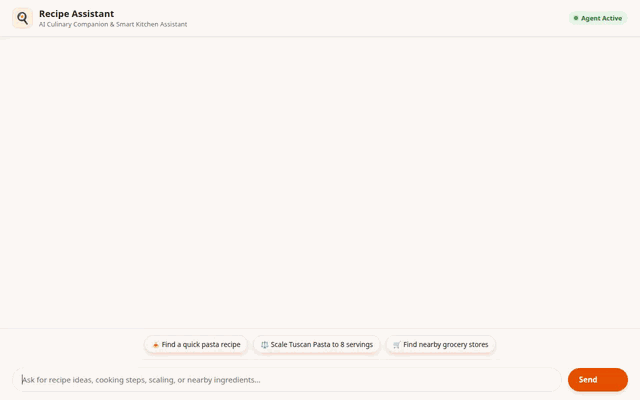

# Recipe Assistant - Smart Kitchen AI & Personal Chef

An intelligent culinary agent built with the Google Agent Development Kit (ADK), Gemini, and Google Cloud services. The Recipe Assistant helps users discover recipes, scale portion yields, locate nearby grocery stores, generate dish visuals and cooking videos, and remember user dietary restrictions.



---

## Implemented Features

Based on the codebase in `app/`, the agent currently implements the following capabilities:

- **Firestore Recipe Database**: Queries and retrieves structured recipes stored in Google Cloud Firestore (`search_recipes`, `get_recipe_details`, `add_recipe`).
- **Yield & Ingredient Scaling**: Rescales ingredient amounts for target serving sizes (`scale_recipe_yield`).
- **External Recipe Discovery**: Searches external meal database APIs for global recipe ideas (`search_external_recipes`).
- **Geolocation & Nearby Grocery Search**: Geocodes user addresses and locates nearby supermarkets and specialty food stores via Google Maps & Places APIs (`geocode_address`, `find_nearby_places`).
- **AI Food Visual Generation**: Generates realistic dish photography using Gemini (`generate_recipe_visual`), uploading image bytes to Google Cloud Storage and saving artifacts to the Playground panel.
- **AI Cooking Video Generation**: Generates short culinary video clips using Google's Omni model (`gemini-omni-flash-preview` via Vertex AI Interactions API) in `generate_recipe_video`, uploading video bytes to Cloud Storage and saving artifacts.
- **Memory Bank Persistence**: Remembers user allergen information and dietary preferences across sessions (`PreloadMemoryTool`, `generate_memories_callback`).
- **Adaptive UI (A2UI)**: Renders structured, interactive UI cards using `A2uiSchemaManager` (BasicCatalog v0.8) for dish details, ingredient lists, and location results.
- **Sandboxed Numerical Execution**: Runs complex numerical calculations securely via `AgentEngineSandboxCodeExecutor`.

---

## Google Cloud Services Integrated

- **Vertex AI & Gemini**: `gemini-2.5-flash` for agent reasoning and `gemini-omni-flash-preview` for video generation.
- **Google Cloud Firestore**: NoSQL document store for persistent recipe catalogs.
- **Google Cloud Storage**: Public bucket hosting generated dish images and video clips.
- **Google Maps & Places APIs**: Address geocoding and supermarket place searches.
- **Agent Engine Reasoning Engine**: Cloud execution environment for agent logic and sandboxed code execution.

---

## Project Structure

```
.
├── app/
│   ├── agent.py            # Main ADK agent definition, tools, and A2UI instruction
│   └── __init__.py
├── frontend/
│   ├── main.py             # FastAPI proxy backend
│   └── static/
│       └── index.html      # Rebranded chat interface & A2UI renderer
├── tests/                  # Integration and unit tests
├── agents-cli-manifest.yaml# Agent Engine manifest
├── demo.gif                # Demonstration recording
└── README.md
```

---

## Local Setup & Running Instructions

### Prerequisites
- Python 3.11+
- `uv` package manager

### Environment Variables
Set the required project and API key configuration:

```bash
export FIRESTORE_PROJECT_ID="your-gcp-project-id"
export GCS_BUCKET_NAME="your-gcs-bucket-name"
export GOOGLE_MAPS_API_KEY="your-google-maps-api-key"
```

### 1. Running the Agent Engine Playground
Start the local ADK Web Playground:

```bash
uv run adk web . --port 8080 --reload_agents
```

### 2. Running the Custom Frontend
Navigate to the `frontend/` directory and launch the FastAPI proxy server:

```bash
cd frontend
export AGENT_ENGINE_RESOURCE_NAME="projects/YOUR_PROJECT/locations/us-central1/reasoningEngines/YOUR_ENGINE_ID"
export AGENT_DIRECTORY="app"
uv run python main.py
```

Access the local web interface by navigating to port 8080 in your web browser.

### 3. Running Unit & Integration Tests

```bash
GOOGLE_GENAI_USE_VERTEXAI=true GOOGLE_CLOUD_PROJECT="your-gcp-project-id" uv run pytest
```
